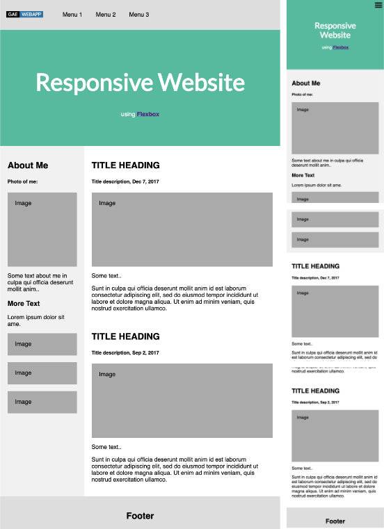

# WEBAPP

@discontinued

webapp application skeleton design for [Google App Engine](https://cloud.google.com/appengine/docs/the-appengine-environments) standard environment.

The skeleton project is proposing structure that can be use to serve: 
- website,
- rest api,
- admin/cms
- or all of them at once from single project. 

It has been created as playground for [spiner](https://github.com/peengle/spiner) project.

To create new webapp just clone this repository open Makefile and change 
`APP_ID`, `SDK_PATH` to your own and run:

```
$ git clone git@github.com:peengle/gae-webapp.git <newproject>
$ cd <newproject>
$ ./bin/init-new-project
```

which will do following steps:

```
rm .git
git init
git commit --allow-empty -m 'Initial commit'
git add .
git commit -m 'Initial project structure'
make build
make run
```

The project structure is very simple to extend, like you can see on below
folder structure every www page, api endpoint is kept in separate namespace

```
.
├── Makefile
├── README.md
├── api
│   ├── __init__.py
│   └── v1
│       └── __init__.py
├── app.yaml
├── appengine_config.py
├── env_variables
│   ├── __init__.py
│   ├── local.py
│   └── local.py.example
├── requirements.txt
└── www
    ├── Makefile
    ├── __init__.py
    ├── package.json
    ├── pages
    │   ├── __init__.py
    │   ├── index
    │   │   ├── __init__.py
    │   │   ├── script.js
    │   │   ├── styles.scss
    │   │   └── tpl.html
    │   └── script.js
    └── resources
        ├── img
        └── layouts
            └── default
                ├── _mixins.scss
                ├── _styles.scss
                ├── _variables.scss
                ├── init.scss
                └── tpl.html
```


